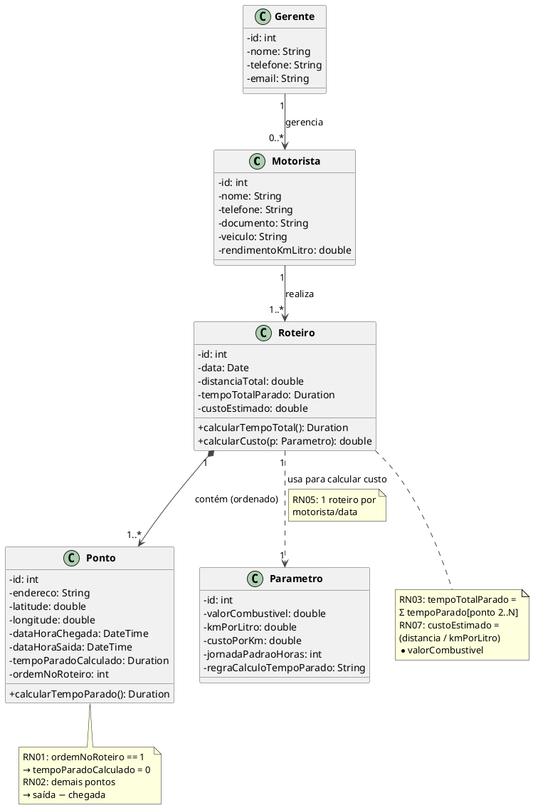

# Modelo de Dados — RouteWatch

**Disciplina:** Engenharia de Software II  
**Professor:** Sandro Laudares  

---

## 1. Entidades e Atributos

### Motorista / Motoboy

| Atributo | Tipo | Descrição |
|----------|------|-----------|
| `id` | int (PK) | Identificador único |
| `nome` | String | Nome completo |
| `telefone` | String | Telefone de contato |
| `documento` | String | CPF ou CNH |
| `veiculo` | String | Descrição do veículo (marca/modelo) |
| `rendimentoKmLitro` | double | Consumo do veículo em km/litro |

---

### Gerente / Coordenador / Dono da Transportadora

| Atributo | Tipo | Descrição |
|----------|------|-----------|
| `id` | int (PK) | Identificador único |
| `nome` | String | Nome completo |
| `telefone` | String | Telefone de contato |
| `email` | String | E-mail corporativo |
| `equipe` | List\<Motorista\> | Equipe sob sua responsabilidade |

---

### Ponto

| Atributo | Tipo | Descrição |
|----------|------|-----------|
| `id` | int (PK) | Identificador único |
| `endereco` | String | Endereço completo do ponto |
| `latitude` | double | Coordenada geográfica |
| `longitude` | double | Coordenada geográfica |
| `dataHoraChegada` | DateTime | Hora de chegada ao ponto |
| `dataHoraSaida` | DateTime | Hora de saída do ponto |
| `tempoParadoCalculado` | Duration | Calculado: saída − chegada (0 se ponto de partida) |
| `ordemNoRoteiro` | int | Posição sequencial no roteiro (1, 2, 3…) |

> **RN01:** `tempoParadoCalculado = 0` quando `ordemNoRoteiro == 1`  
> **RN02:** `tempoParadoCalculado = dataHoraSaida − dataHoraChegada` para demais pontos

---

### Roteiro

| Atributo | Tipo | Descrição |
|----------|------|-----------|
| `id` | int (PK) | Identificador único |
| `data` | Date | Data do roteiro |
| `motorista` | Motorista (FK) | Motorista responsável |
| `pontos` | List\<Ponto\> | Lista ordenada de pontos |
| `distanciaTotal` | double | Distância total percorrida em km |
| `tempoTotalParado` | Duration | Soma dos tempos parados (exceto ponto 1) |
| `custoEstimado` | double | Calculado com base nos parâmetros de custo |

> **RN05:** Cada roteiro pertence a um único motorista e a uma única data.

---

### Parâmetro

| Atributo | Tipo | Descrição |
|----------|------|-----------|
| `id` | int (PK) | Identificador único |
| `valorCombustivel` | double | Preço do combustível (R$/litro) |
| `kmPorLitro` | double | Rendimento do veículo (km/litro) |
| `custoPorKm` | double | Custo por km percorrido (R$/km) |
| `jornadaPadraoHoras` | int | Jornada padrão de trabalho (padrão: 8h) |
| `regraCalculoTempoParado` | String | Regra de negócio aplicada ao cálculo |

---

## 2. Diagrama de Classes Conceitual



---

## 3. Relacionamentos

| Relacionamento | Cardinalidade | Descrição |
|----------------|---------------|-----------|
| Gerente → Motorista | 1 para N | Um gerente gerencia vários motoristas |
| Motorista → Roteiro | 1 para N | Um motorista realiza vários roteiros (em datas diferentes) |
| Roteiro → Ponto | 1 para N (ordenado) | Um roteiro contém 1 ou mais pontos em sequência |
| Roteiro → Parâmetro | N para 1 (usa) | Vários roteiros usam os mesmos parâmetros globais |

---

## 4. Fórmulas de Cálculo

### Tempo Parado por Ponto
```
se ponto.ordemNoRoteiro == 1:
    tempoParado = 0           ← RN01
senão:
    tempoParado = dataHoraSaida − dataHoraChegada   ← RN02
```

### Tempo Total Parado do Roteiro
```
tempoTotalParado = Σ ponto.tempoParado  para todo ponto com ordem >= 2   ← RN03
```

### Percentual em Relação à Jornada
```
percentualParado = (tempoTotalParado / jornadaPadraoHoras) × 100   ← RN04
```

### Custo Estimado do Roteiro
```
litrosConsumidos = distanciaTotal / kmPorLitro
custoEstimado    = litrosConsumidos × valorCombustivel              ← RN07
```
