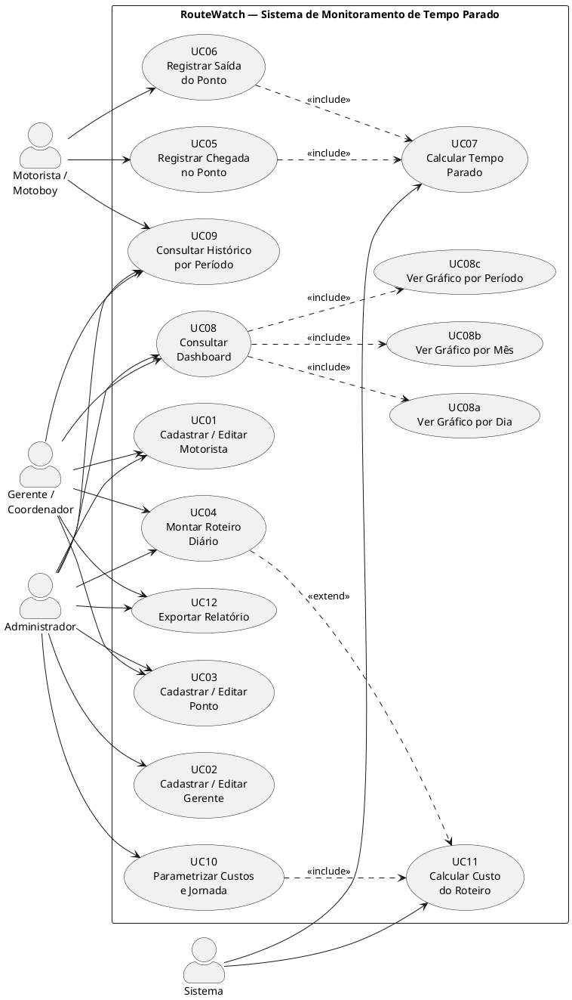

# Casos de Uso — RouteWatch

**Disciplina:** Engenharia de Software II  
**Professor:** Sandro Laudares  

---

## 1. Atores

| Ator | Tipo | Descrição |
|------|------|-----------|
| **Motorista/Motoboy** | Primário | Profissional de campo; registra chegada/saída nos pontos do roteiro e consulta seu histórico. |
| **Gerente/Coordenador** | Primário | Gestor da equipe; cadastra roteiros, motoristas e pontos; consulta dashboard e exporta relatórios. |
| **Administrador** | Primário | Acesso total ao sistema; parametriza custos, jornada e gerencia usuários. |

---

## 2. Lista de Casos de Uso

| ID | Nome | Ator Principal | Prioridade |
|----|------|---------------|-----------|
| UC01 | Cadastrar / Editar Motorista | Gerente, Admin | Alta |
| UC02 | Cadastrar / Editar Gerente | Admin | Alta |
| UC03 | Cadastrar / Editar Ponto | Gerente, Admin | Alta |
| UC04 | Montar Roteiro Diário | Gerente, Admin | Alta |
| UC05 | Registrar Chegada no Ponto | Motorista | Alta |
| UC06 | Registrar Saída do Ponto | Motorista | Alta |
| UC07 | Calcular Tempo Parado | Sistema | Alta |
| UC08 | Consultar Dashboard | Gerente, Admin | Alta |
| UC09 | Consultar Histórico por Período | Gerente, Admin, Motorista | Alta |
| UC10 | Parametrizar Custos e Jornada | Admin | Média |
| UC11 | Calcular Custo do Roteiro | Sistema | Média |
| UC12 | Exportar Relatório | Gerente, Admin | Baixa |

---

## 3. Diagrama de Casos de Uso

---

## 4. Descrições dos Casos de Uso Principais

---

### UC04 — Montar Roteiro Diário

| Campo | Detalhe |
|-------|---------|
| **Atores** | Gerente/Coordenador, Administrador |
| **Pré-condições** | Motorista e pontos previamente cadastrados |
| **Pós-condições** | Roteiro criado e disponível para o motorista executar |

**Fluxo Principal:**
1. Gerente seleciona a data do roteiro
2. Gerente seleciona o motorista responsável
3. Gerente adiciona pontos em ordem sequencial (1, 2, 3…)
4. O ponto 1 é marcado automaticamente como ponto de partida (RN01)
5. Sistema valida que não existe roteiro para o mesmo motorista na mesma data (RN05)
6. Sistema salva o roteiro

**Fluxo Alternativo A — Roteiro duplicado:**  
- Se já existir roteiro para o motorista/data, o sistema exibe mensagem de erro e solicita correção.

**Regras aplicadas:** RN05, RN06

---

### UC05 + UC06 — Registrar Chegada e Saída no Ponto

| Campo | Detalhe |
|-------|---------|
| **Atores** | Motorista/Motoboy |
| **Pré-condições** | Roteiro do dia atribuído ao motorista |
| **Pós-condições** | Data/hora de chegada/saída registradas; tempo parado calculado |

**Fluxo Principal (UC05 — Chegada):**
1. Motorista acessa o roteiro do dia
2. Motorista seleciona o ponto onde chegou
3. Sistema registra a data/hora atual como `dataHoraChegada`

**Fluxo Principal (UC06 — Saída):**
1. Motorista seleciona o ponto que está deixando
2. Sistema registra a data/hora atual como `dataHoraSaida`
3. Sistema executa **UC07** automaticamente

**Regras aplicadas:** RN01, RN02

---

### UC07 — Calcular Tempo Parado

| Campo | Detalhe |
|-------|---------|
| **Atores** | Sistema (interno) |
| **Acionado por** | UC06 (ao registrar saída) |

**Fluxo Principal:**
1. Sistema verifica a `ordemNoRoteiro` do ponto
2. **Se ordem == 1:** `tempoParado = 0` (RN01)
3. **Caso contrário:** `tempoParado = dataHoraSaida − dataHoraChegada` (RN02)
4. Sistema recalcula `tempoTotalParado` do roteiro (RN03)
5. Sistema recalcula `custoEstimado` se `distanciaTotal` informada (RN07)

---

### UC08 — Consultar Dashboard

| Campo | Detalhe |
|-------|---------|
| **Atores** | Gerente/Coordenador, Administrador |
| **Pré-condições** | Pelo menos um roteiro com pontos registrados |

**Fluxo Principal:**
1. Usuário acessa o dashboard
2. Sistema exibe três recortes de gráfico:
   - **Por Dia:** barras com tempo parado de cada roteiro no dia
   - **Por Mês:** barras agrupadas por mês do ano
   - **Por Período:** linha comparativa entre datas selecionadas
3. Usuário pode filtrar por motorista ou período

**Regras aplicadas:** RN03, RN04 (percentual da jornada)

---

### UC10 — Parametrizar Custos e Jornada

| Campo | Detalhe |
|-------|---------|
| **Atores** | Administrador |
| **Pré-condições** | Usuário autenticado como Administrador (RNF04) |

**Fluxo Principal:**
1. Admin acessa a tela de parâmetros
2. Admin define/edita: valor do combustível, km/litro, custo por km, jornada padrão
3. Sistema valida os valores e salva
4. Todos os cálculos futuros passam a usar os novos parâmetros

**Critério de aceitação:** Parâmetros podem ser alterados sem modificação de código-fonte.
