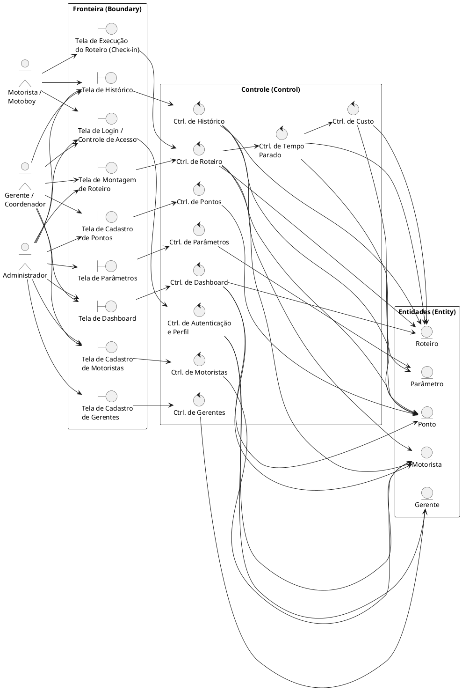

# Diagrama de Robustez — RouteWatch

**Disciplina:** Engenharia de Software II  
**Professor:** Sandro Laudares  

---

## 1. Introdução

O diagrama de robustez detalha a interação entre **atores**, **objetos de fronteira (boundary)**, **objetos de controle (control)** e **entidades (entity)** para os principais casos de uso do sistema. É uma ponte entre os casos de uso e o diagrama de classes, mostrando como a lógica de negócio flui da interface até a persistência.

---

## 2. Diagrama de Robustez — Fluxo Completo



---

## 3. Descrição dos Objetos

### Objetos de Fronteira (Boundary)

| Boundary | Responsabilidade |
|----------|-----------------|
| **Tela de Login / Controle de Acesso** | Autenticação de usuários e redirecionamento por perfil (RNF04) |
| **Tela de Cadastro de Motoristas** | Formulário CRUD para motoristas/motoboys |
| **Tela de Cadastro de Gerentes** | Formulário CRUD para gerentes/coordenadores |
| **Tela de Cadastro de Pontos** | Formulário para pontos com endereço e coordenadas |
| **Tela de Montagem de Roteiro** | Interface para montar roteiro diário (motorista + data + pontos ordenados) |
| **Tela de Execução do Roteiro** | Interface de check-in/check-out usada pelo motorista em campo |
| **Tela de Dashboard** | Painel com gráficos de tempo parado (dia/mês/período) |
| **Tela de Histórico** | Listagem filtrável de roteiros e pontos com tempos parados |
| **Tela de Parâmetros** | Configurações de custo e jornada (acesso restrito ao Admin) |

### Objetos de Controle (Control)

| Control | Responsabilidade |
|---------|-----------------|
| **Ctrl. de Autenticação e Perfil** | Valida credenciais; define permissões por perfil (RNF04) |
| **Ctrl. de Motoristas** | Lógica CRUD de motoristas; validações de documento e veículo |
| **Ctrl. de Gerentes** | Lógica CRUD de gerentes; associação com equipe |
| **Ctrl. de Pontos** | Lógica CRUD de pontos; validação de endereço e coordenadas |
| **Ctrl. de Roteiro** | Criação/edição de roteiros; validação de unicidade motorista/data (RN05); ordenação de pontos (RN06) |
| **Ctrl. de Tempo Parado** | Executa RN01, RN02, RN03: calcula tempo parado por ponto e total do roteiro |
| **Ctrl. de Custo** | Executa RN07: calcula custo estimado usando parâmetros e distância |
| **Ctrl. de Dashboard** | Agrega dados de roteiros/pontos para geração dos gráficos (dia, mês, período) |
| **Ctrl. de Histórico** | Filtra e ordena roteiros/pontos por período; formata para exibição |
| **Ctrl. de Parâmetros** | Persiste e recupera parâmetros globais de custo e jornada |

### Entidades (Entity)

| Entity | Responsabilidade |
|--------|-----------------|
| **Motorista** | Armazena dados pessoais e do veículo dos profissionais de campo |
| **Gerente** | Armazena dados do gestor e associação com equipe |
| **Ponto** | Armazena endereço, coordenadas, timestamps e tempo parado calculado |
| **Roteiro** | Agrega pontos em ordem, data, motorista, distância, tempo total e custo |
| **Parâmetro** | Configurações globais de custo e jornada (alteráveis sem mudança de código) |

---

## 4. Fluxos Detalhados

### Fluxo: Registrar Chegada + Saída → Calcular Tempo Parado

```
Motorista
  → TelaExecucao (seleciona ponto, clica "Chegada")
    → CtrlRoteiro (busca roteiro do dia)
      → CtrlTempo (registra dataHoraChegada no EntPonto)

Motorista
  → TelaExecucao (clica "Saída")
    → CtrlRoteiro
      → CtrlTempo
        → EntPonto (verifica ordemNoRoteiro)
          → [se ordem == 1]: tempoParado = 0          ← RN01
          → [se ordem > 1]: tempoParado = saída − chegada ← RN02
        → EntRoteiro (recalcula tempoTotalParado)       ← RN03
        → CtrlCusto (recalcula custoEstimado)
          → EntParametro (lê valorCombustivel, kmPorLitro) ← RN07
          → EntRoteiro (atualiza custoEstimado)
```

### Fluxo: Consultar Dashboard

```
Gerente/Admin
  → TelaDashboard (seleciona recorte: dia / mês / período)
    → CtrlDashboard
      → EntRoteiro (filtra por data/período)
      → EntPonto (agrega temposParados)
      → EntMotorista (para filtro opcional por motorista)
    → TelaDashboard (renderiza gráficos via Chart.js)
```
